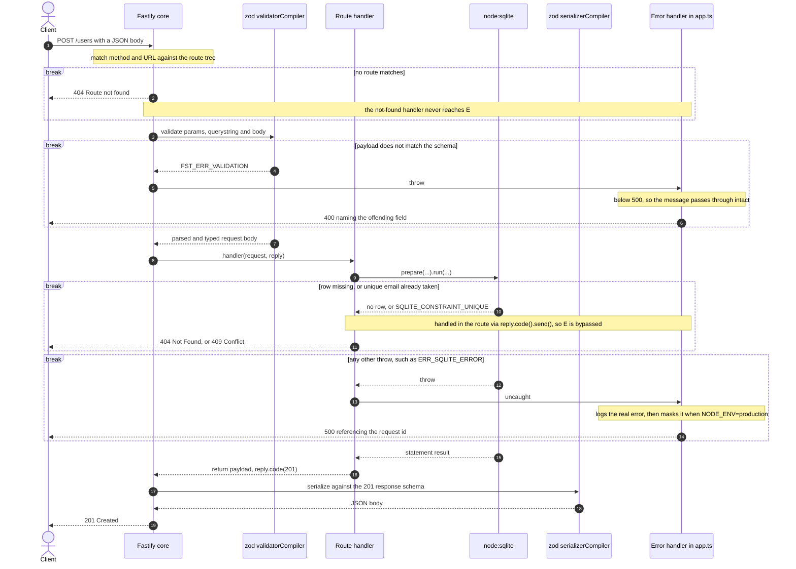

# sample-fastify-site
TS node no-build template repo

## Request handling

Every request walks the same lifecycle: route match, zod validation, handler,
zod serialization, reply. Each stage can exit early, and *which* stage exits
determines both the status code and whether the error handler sees it at all.

### Observed responses

Captured from the app itself via `inject()`, not from the spec:

| Case | Status | Body |
|---|---|---|
| Valid `POST /users` | 201 | `{"id":1}` |
| `email` fails the zod refinement | 400 | `{"statusCode":400,"error":"FST_ERR_VALIDATION","message":"body/email Invalid email address"}` |
| `POST` an email that already exists | 409 | `{"statusCode":409,"error":"Conflict","message":"Email already registered"}` |
| `PATCH /users/999` on a missing row | 404 | `{"statusCode":404,"error":"Not Found","message":"User 999 not found"}` |
| `GET /nope` | 404 | `{"message":"Route GET:/nope not found","error":"Not Found","statusCode":404}` |
| Handler throws, non-production | 500 | `{"statusCode":500,"error":"ERR_SQLITE_ERROR","message":"no such table: users"}` |
| Handler throws, `NODE_ENV=production` | 500 | `{"statusCode":500,"error":"ERR_SQLITE_ERROR","message":"Internal Server Error. Please contact support with request id req-1."}` |

### Three ways a request can fail, and why they differ

- **Through the error handler.** Anything thrown — validation errors, unexpected
  driver errors — reaches `setErrorHandler` in `src/app.ts`. It always logs the
  real error, then decides what to disclose: below 500 the message is *for* the
  caller and passes through, at 500 and above it is replaced in production with a
  request-id reference.
- **Around the error handler.** The route handlers return 404 and 409 with
  `reply.code().send()`, which is a normal reply, not a throw. Changing the error
  handler does not affect those responses.
- **Before the error handler.** A routing miss is `setNotFoundHandler`, separate
  machinery again — which is why masking 5xx detail leaves the 404 shape alone.

### Health endpoints

- `GET /health` — liveness. Touches no dependencies on purpose, so a sick
  database cannot make an orchestrator restart an otherwise healthy process.
- `GET /health/ready` — readiness. Probes the database and returns 503 when it is
  unusable.
